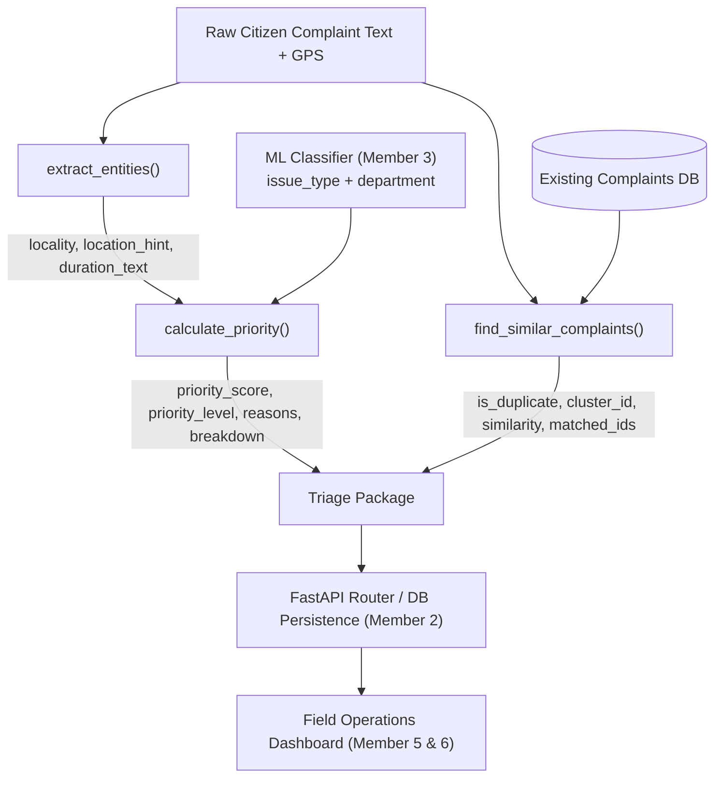

# CivicFlow — Member 4 Component Description
## Operational Intelligence: Priority Scoring, Entity Extraction & Duplicate Detection

---

## 1. Overview & System Role

In a civic incident response platform, text classification alone (determining department and issue category) is insufficient for triage. Municipal bodies receive thousands of overlapping complaints daily. The core operational challenge is:
1. **Assessing urgency transparently** so field teams know *why* an incident needs immediate intervention.
2. **Extracting key geographic and temporal entities** without demanding excessive manual metadata entry from citizens.
3. **Clustering duplicates and co-located incidents** without deleting or suppressing citizen submissions.

**Member 4** owns the **Operational Intelligence Layer**, transforming raw unstructured complaints and classification outputs into actionable, prioritized, and de-duplicated operational intelligence.

---

## 2. Architecture & Data Flow

---

## 3. Detailed Component Breakdown

### Component 1: Explainable Priority Scoring Engine (`priority.py`)

Rather than an opaque "black-box" model score, municipal operations require clear justification to allocate public resources fairly and accountably.

- **Scale**: Continuous 0–100 integer score.
- **Levels**:
  - `0–30`: **Low** (Minor maintenance, cosmetic defects, non-blocking items)
  - `31–60`: **Medium** (Standard service disruptions, recurring garbage, road cracks)
  - `61–100`: **High** (Immediate hazards, safety risks, public facility disruptions)
- **Scoring Dimensions**:
  | Dimension | Points | Description & Criteria |
  | :--- | :---: | :--- |
  | **Severity** | $0 - 40$ | Mapped to categorized `issue_type` (e.g., Gas Leak: 40, Sewage Overflow: 38, Pothole: 30, Graffiti: 8). |
  | **Duration** | $0 - 20$ | Unresolved time urgency ($>48\text{ hrs} \to 15\text{ pts}$, $>7\text{ days} \to 20\text{ pts}$). |
  | **Public Impact** | $0 - 20$ | Proximity to public institutions (schools, hospitals, transit hubs, markets, places of worship). |
  | **Safety Risk** | $0 - 20$ | Presence of hazard keywords (children, electrocution, accident, collapse, contaminated water). |

- **Explainability Output**:
  Every score is accompanied by human-readable reasons in `priority_reasons`, e.g.:
  - `"High-severity issue type: Sewage Overflow"`
  - `"Reported duration exceeds 48 hours"`
  - `"Public location detected: school"`
  - `"Safety-related infrastructure issue"`

---

### Component 2: Rule-Based Entity Extraction (`entities.py`)

Extracts operational entities directly from raw citizen text without requiring large transformer dependencies:

- **Duration Extraction**:
  - Captures elapsed time expressions: `"for 5 days"`, `"since Monday"`, `"past 2 weeks"`, `"48 hours ago"`, `"already 3 days"`.
  - Normalizes durations for the downstream priority engine.
- **Locality & Location Hint Extraction**:
  - Identifies urban locality nomenclatures (e.g. `Krishna Nagar`, `Sector 14`, `Ward 8`, `MG Road`, `Phase 2`, `Indira Colony`).
  - Detects physical micro-landmarks (`"near Gate 2"`, `"Pillar 142"`, `"opp Metro Station"`, `"behind Bus Stand"`).
  - Handles prepositional phrasing (`"in <Locality>"`, `"at <Locality>"`) and filters non-location stop words.

---

### Component 3: Duplicate Complaint Detection (`duplicates.py`)

Citizens living in the same neighborhood frequently report the exact same civic issue. De-duplication must cluster these reports operationally while retaining every citizen's submission for accountability.

- **Hybrid Detection Model**:
  1. **Textual Cosine Similarity (TF-IDF)**: Compares complaint descriptions using token and bi-gram TF-IDF cosine similarity.
  2. **Geospatial Distance (Haversine Formula)**: Computes the great-circle surface distance in meters between GPS coordinate pairs:
     $$d = 2R \arcsin\left(\sqrt{\sin^2\left(\frac{\Delta\phi}{2}\right) + \cos(\phi_1)\cos(\phi_2)\sin^2\left(\frac{\Delta\lambda}{2}\right)}\right)$$
- **Operational Logic**:
  - **With Coordinates**: If distance $\le 150\text{ m}$ and text similarity $\ge 0.65 \implies$ Marked as duplicate.
  - **Without Coordinates**: If text similarity $\ge 0.82 \implies$ Marked as duplicate.
- **Cluster Tracking**:
  - Matches are assigned to a unified `duplicate_cluster_id` (e.g. `CL-1008`).
  - Returns `matched_complaint_ids` so operators can view all linked citizen submissions.
  - **Zero Data Deletion**: No submission is ever dropped or overwritten.

---

## 4. Key Design Principles

1. **Explainable AI (XAI)**: No mystery scores. Every point added to priority is backed by an explicit reason string for municipal auditors.
2. **Separation of Configuration from Logic**: Thresholds, keyword dictionaries, and severity weights live in clean `CONFIG` and `DUPLICATE_CONFIG` dictionaries, allowing instant policy updates without altering core code.
3. **High Performance & Zero Heavyweight Overhead**: Uses optimized regex, pure-Python Haversine math, and scikit-learn TF-IDF, executing in milliseconds with minimal CPU and memory footprint.
4. **Resilience & Fallbacks**: Works seamlessly when GPS coordinates, duration, or locality are missing, degrading gracefully without throwing exceptions.

---

## 5. File Manifest

| File | Purpose |
| :--- | :--- |
| [`backend/services/priority.py`](backend/services/priority.py) | Priority scoring algorithm, keyword tables, and severity matrices. |
| [`backend/services/entities.py`](backend/services/entities.py) | Regex parsers for duration, locality, and landmark hints. |
| [`backend/services/duplicates.py`](backend/services/duplicates.py) | TF-IDF text similarity and Haversine geospatial proximity engine. |
| [`backend/services/__init__.py`](backend/services/__init__.py) | Clean unified entry-point for FastAPI backend import. |
| [`tests/test_member4.py`](tests/test_member4.py) | Automated test suite validating all functional edge cases. |
| [`docs/member4_handoff.md`](docs/member4_handoff.md) | Inter-team API contract and payload specification for Member 2. |
| [`setup.md`](setup.md) | Step-by-step installation, test execution, and usage instructions. |
